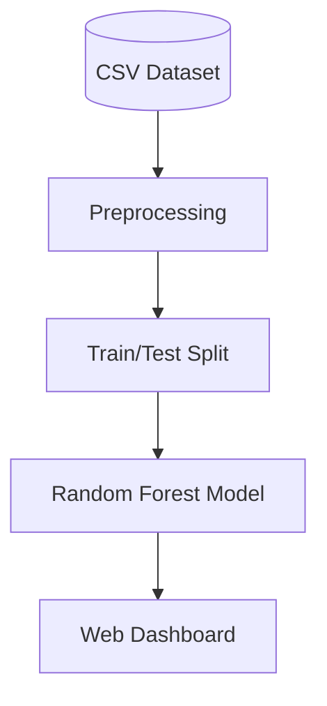

# Smart Parking System using IoT & Machine Learning

## 1. Introduction
The **Smart Parking System** is an integrated IoT solution designed to alleviate urban traffic congestion caused by parking search. By combining real-time sensor data with machine learning predictions, the system provides users with instant availability status and future occupancy forecasts.

## 2. Problem Statement
*   **Traffic Congestion**: Approximately 30% of urban traffic is generated by drivers searching for parking.
*   **Environmental Impact**: Excessive idling leads to increased fuel consumption and carbon emissions.
*   **Inefficiency**: Lack of real-time data results in uneven utilization of parking infrastructure.

## 3. Solution Overview
Our solution bridges the gap between physical infrastructure and digital intelligence:
1.  **IoT Edge Layer**: Detects vehicle presence using IR sensors.
2.  **Cloud Server**: Aggregates data and hosts the web interface.
3.  **Machine Learning**: Analyzes historical patterns to predict future availability.

## 4. System Architecture

### 4.1 Hardware Data Flow
The hardware ecosystem is designed for low-latency transmission:
1.  **IR Sensor**: Detects the presence of a vehicle at a specific slot.
2.  **Arduino Mega**: Acts as the central microcontroller, reading digital signals from multiple sensors.
3.  **ESP8266 WiFi Module**: Receives serial data from the Arduino and transmits it to the server via HTTP POST requests.

### 4.2 Software & ML Pipeline
The software backend handles data ingestion, storage, and intelligence:
1.  **Data Ingestion**: Flask API endpoints receive JSON payloads from the hardware.
2.  **Storage**: Data is logged to a CSV database (`parking_dataset.csv`) with timestamps.
3.  **Training**: A Random Forest Regressor model trains on this historical data.
4.  **Prediction**: The model predicts occupancy probability based on `Hour` and `Day of Week`.

## 5. Key Features
*   **Real-time Monitoring**: Instant visual feedback of parking slot status (Occupied/Free).
*   **Predictive Analytics**: Users can check availability for future dates and times.
*   **Automated Data Logging**: Continuous collection of occupancy data for model improvement.
*   **Responsive Web Dashboard**: Accessible on mobile and desktop devices.

## 6. Technology Stack

### Hardware
*   **Sensors**: Infrared (IR) Obstacle Sensors
*   **Microcontrollers**: Arduino Mega 2560, ESP8266 (NodeMCU)

### Software
*   **Backend**: Python, Flask
*   **Machine Learning**: Scikit-learn, Pandas, NumPy
*   **Frontend**: HTML5, Tailwind CSS, JavaScript

## 7. Conclusion
This project demonstrates a scalable, end-to-end implementation of a Smart Parking System. By leveraging IoT for real-time data and Machine Learning for predictive insights, it offers a viable solution to modern urban mobility challenges.
